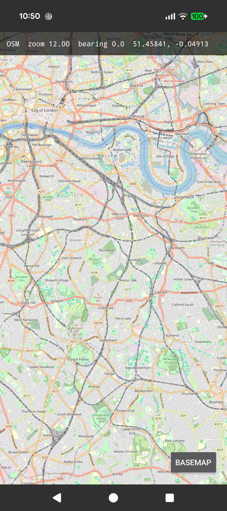

# TerraVista for Android

A drop-in map view. Add the dependency, put `MapView` in a layout, and you get a
pannable, pinch-zoomable, rotatable raster map. No Rust, no JNI, no NDK.



## Install

```groovy
// settings.gradle.kts
dependencyResolutionManagement {
    repositories {
        maven { url = uri("https://jitpack.io") }
    }
}

// app/build.gradle.kts
dependencies {
    implementation("com.github.GeoLang:terravista:0.2.0")
}
```

Ships `arm64-v8a` and `x86_64`. The `INTERNET` permission comes with the library.

## Use

```xml
<dev.geolang.terravista.MapView
    android:id="@+id/map"
    android:layout_width="match_parent"
    android:layout_height="match_parent"
    app:tvCenterLatitude="51.5074"
    app:tvCenterLongitude="-0.1278"
    app:tvZoom="12" />
```

```kotlin
class MainActivity : Activity() {
    private lateinit var map: MapView

    override fun onCreate(savedInstanceState: Bundle?) {
        super.onCreate(savedInstanceState)
        setContentView(R.layout.activity_main)
        map = findViewById(R.id.map)
        map.onCameraChangeListener = OnCameraChangeListener { Log.i("map", "$it") }
    }

    override fun onDestroy() {
        map.destroy()
        super.onDestroy()
    }
}
```

`destroy()` frees the native map. Skip it and the map leaks until the process dies.

## API

| Member | Meaning |
|--------|---------|
| `setCenter(lat, lon)` | move the centre |
| `cameraPosition` | current centre, zoom and bearing |
| `zoom` | camera zoom, clamped to `minZoom`..`maxZoom` |
| `bearing` | rotation in degrees, 0 is north up |
| `minZoom` / `maxZoom` | zoom limits, default 0 and 18 |
| `tileUrlTemplate` | XYZ template, default OpenStreetMap |
| `onCameraChangeListener` | fires on every camera move |
| `destroy()` | free the native map, idempotent |

XML attributes mirror these: `tvCenterLatitude`, `tvCenterLongitude`, `tvZoom`,
`tvBearing`, `tvMinZoom`, `tvMaxZoom`, `tvTileUrlTemplate`.

Changing `tileUrlTemplate` drops every cached tile, because the cache is keyed by
tile coordinate alone and would otherwise serve the old basemap's images.

## Tile sources

Default is `https://tile.openstreetmap.org/{z}/{x}/{y}.png`. Respect the
[OSM tile policy](https://operations.osmfoundation.org/policies/tiles/) or point
`tileUrlTemplate` at your own server.

The core asks for tiles at `round(zoom + log2(density))`, so a 2.6x screen at camera
zoom 12 fetches z13 and one tile lands on 256 device pixels instead of being upscaled.
Zooming past what your source serves degrades to upscaled parent tiles rather than
blank space, so `maxZoom` is a quality knob, not a correctness one.

## Build from source

```bash
cd android
./gradlew :terravista:assembleRelease      # AAR
./gradlew :sample:installDebug             # sample on a connected device
./gradlew :terravista:publishToMavenLocal  # com.github.GeoLang:terravista:0.2.0
```

Needs JDK 17 or later. Gradle 8.9 does not run on JDK 25, so if that is your default
point it at an older one:

```bash
JAVA_HOME=~/.jdks/jdk-21.0.12+8 ./gradlew :terravista:assembleRelease
```

### Native libraries

`terravista/src/main/jniLibs/*/*.so` are **committed prebuilt**, because JitPack has
no Rust toolchain and could not otherwise produce them. Rebuild after any change to
`crates/terravista-ffi` or the JNI glue, then commit the result:

```bash
./tools/build-natives.sh
```

That builds the Rust core with cargo-ndk and the JNI glue with the NDK clang, for both
ABIs, and verifies every LOAD segment is 16 KB aligned. Android 15 and later require
that alignment, and devices with 16 KB pages refuse to load anything else. Neither
rustc nor a bare clang link does it by default, so the script passes
`-Wl,-z,max-page-size=16384`.

Needs `ANDROID_NDK_HOME` (default `~/android-ndk-r27c`), `cargo-ndk`, and the
`aarch64-linux-android` and `x86_64-linux-android` Rust targets.
